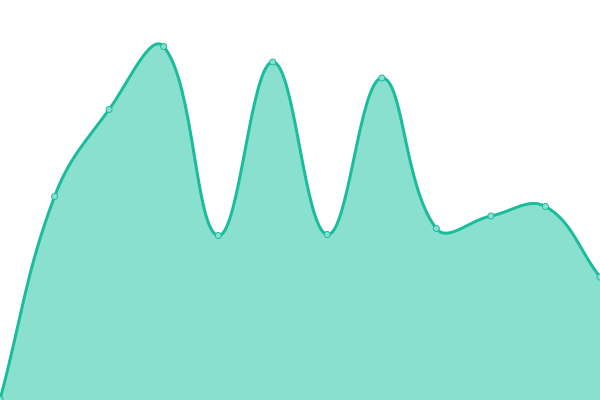

# [📈 Live Status](https://status.aidanjohnston.ca): <!--live status--> **🟧 Partial outage**

This repository contains the open-source uptime monitor and status page for [Aidan Johnston](www.aidanjohnston.ca), powered by [Upptime](https://github.com/upptime/upptime).

With [Upptime](https://upptime.js.org), you can get your own unlimited and free uptime monitor and status page, powered entirely by a GitHub repository. We use [Issues](https://github.com/AidanJohnston/status/issues) as incident reports, [Actions](https://github.com/AidanJohnston/status/actions) as uptime monitors, and [Pages](https://status.aidanjohnston.ca) for the status page.

<!--start: status pages-->
<!-- This summary is generated by Upptime (https://github.com/upptime/upptime) -->
<!-- Do not edit this manually, your changes will be overwritten -->
<!-- prettier-ignore -->
| URL | Status | History | Response Time | Uptime |
| --- | ------ | ------- | ------------- | ------ |
|  [Website](https://www.aidanjohnston.ca) | 🟥 Down | [website.yml](https://github.com/AidanJohnston/status/commits/HEAD/history/website.yml) | 

 0ms
     
 | 

<a href="https://status.aidanjohnston.ca/history/website">0.00%</a>
    

|  [Media Server](https://media.aidanjohnston.ca) | 🟥 Down | [media-server.yml](https://github.com/AidanJohnston/status/commits/HEAD/history/media-server.yml) | 

 0ms
     
 | 

<a href="https://status.aidanjohnston.ca/history/media-server">0.00%</a>
    

|  [Request Server](https://request.aidanjohnston.ca/login) | 🟥 Down | [request-server.yml](https://github.com/AidanJohnston/status/commits/HEAD/history/request-server.yml) | 

 0ms
     
 | 

<a href="https://status.aidanjohnston.ca/history/request-server">0.00%</a>
    

|  [Minecraft Server](minecraft.aidanjohnston.ca) | 🟩 Up | [minecraft-server.yml](https://github.com/AidanJohnston/status/commits/HEAD/history/minecraft-server.yml) | 

 38ms
     
 | 

<a href="https://status.aidanjohnston.ca/history/minecraft-server">100.00%</a>
    

|  [CSGO Server](https://csgo.aidanjohnston.ca) | 🟥 Down | [csgo-server.yml](https://github.com/AidanJohnston/status/commits/HEAD/history/csgo-server.yml) | 

 0ms
     
 | 

<a href="https://status.aidanjohnston.ca/history/csgo-server">0.00%</a>
    

|  [Fantaski](https://fantaski.aidanjohnston.ca) | 🟩 Up | [fantaski.yml](https://github.com/AidanJohnston/status/commits/HEAD/history/fantaski.yml) | 

 120ms
     
 | 

<a href="https://status.aidanjohnston.ca/history/fantaski">100.00%</a>
    

<!--end: status pages-->

[**Visit our status website →**](https://status.aidanjohnston.ca)

## 📄 License

- Powered by: [Upptime](https://github.com/upptime/upptime)
- Code: [MIT](./LICENSE) © [Aidan Johnston](www.aidanjohnston.ca)
- Data in the `./history` directory: [Open Database License](https://opendatacommons.org/licenses/odbl/1-0/)
